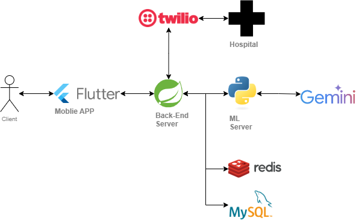

# MediCall

## 1. Project Overview

---
During patient transport, issues arise when hospitals cannot admit patients or lack available medical staff, causing a loss of the critical "golden time".
MediCall allows paramedics to simply input patient condition and location; then, AI simultaneously contacts nearby hospital emergency rooms to
automatically recommend the first available hospital that responds.

### Other Parts
- [Atempo-Client](https://github.com/gdsc-konkuk/24-25-proj-Atempo-Client)
- [Atempo-AI](https://github.com/gdsc-konkuk/24-25-proj-Atempo-AI)

## 2. Tech Stack

---
### 🛠️ Backend Development
<p>
    
    
    
</p>

### 🗄️ Database & Caching
<p>
    
    
</p>

### 🔐 Authentication & Security
<p>
    
    
    
</p>

### 🔗 Communication Protocols
<p>
    
    
</p>

### 🛠️ API Frameworks & Design
<p>
    
    
</p>

### 🌐 Third-Party Integration
<p>
    
</p>

### 🧑‍💻 DevOps & Collaboration
<p>
    
    
    
    
</p>

### 📄 Documentation
<p>
    
</p>


## 3. Architecture

---
## BackEnd System Architecture


## Atempo Service Architecture


## 4. Service Flow

---
```
[Paramedics - Flutter App] 
  → Send patient condition and location
       ↓
[Server - Gemini AI] 
  → Select hospital list and generate guidance message
       ↓
[Twilio] 
  → Parallel calls; hospital responds with dial (1: Accept / 2: Reject)
       ↓
[Analyze response results + calculate distance]
       ↓
[Final hospital recommendation + Google Maps route guidance]
```


## 5. API Documentation

---
- [api-docs.json](./docs/api-docs.json)
- [Swagger UI](http://Avenir.my:8080/swagger-ui.html)

## 6. Database Schema

---

